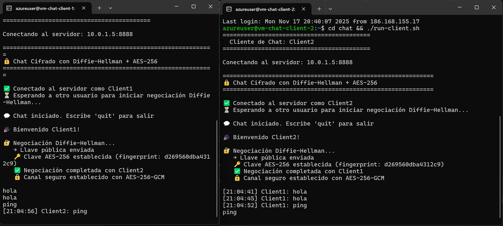
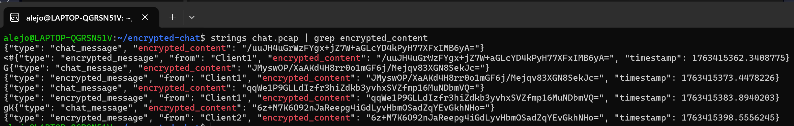

# Chat Cifrado con Diffie-Hellman y AES-256-GCM

## Autores

> - Alejandro Londoño Bermúdez - A00395978
> - Juan David Colonia Aldana - A00395956
> - Miguel Ángel Gonzalez Arango - A00395687

## 1. Objetivo

Implementar un sistema de chat seguro donde dos instancias del programa ejecutadas en máquinas distintas establezcan comunicación cifrada punto a punto.
Una vez conectadas, deben negociar una clave simétrica mediante Diffie-Hellman y utilizarla para cifrar toda la conversación usando AES-256-GCM.

## 1.1. Requisitos

**Para ejecución local:**

- Python 3.8 o superior
- Biblioteca `cryptography`

**Para despliegue en Azure:**

- Azure CLI
- Terraform (v1.0+)
- Ansible (v2.13+)

### Instalación de dependencias

```bash
pip install -r requirements.txt
```

### Estructura del proyecto

```
encrypted-chat/
├── src/                           # Código fuente
│   ├── crypto_utils.py            # Lógica criptográfica (DH + AES-256-GCM)
│   ├── server.py                  # Servidor relay
│   └── client.py                  # Cliente de chat
│
├── scripts/                       # Scripts de automatización
│   ├── deploy.sh                  # Despliegue completo en Azure
│   └── destroy.sh                 # Limpieza de infraestructura
│
├── terraform/                     # Infraestructura como código
│   ├── modules/
│   │   ├── resource_group/        # Módulo: Resource Group
│   │   ├── security/              # Módulo: Network Security Groups
│   │   ├── network/               # Módulo: VNet y Subnet
│   │   └── vm/                    # Módulo: Máquinas virtuales
│   ├── templates/
│   │   └── inventory.tpl          # Template inventario Ansible
│   ├── main.tf                    # Configuración principal
│   ├── variables.tf               # Variables de entrada
│   └── outputs.tf                 # Outputs (IPs, etc.)
│
├── ansible/                       # Automatización de configuración
│   ├── roles/
│   │   ├── common/                # Rol: configuración común
│   │   ├── server/                # Rol: servidor de chat
│   │   └── client/                # Rol: clientes
│   ├── inventory/
│   │   └── hosts.ini              # Generado por Terraform
│   ├── playbook.yml               # Playbook principal
│   └── ansible.cfg                # Configuración de Ansible
│
├── images/                        # Capturas de pantalla
├── requirements.txt               # Dependencias Python
└── README.md                      # Este archivo
```

## 1.2. Ejecución Local

### 1.2.1. Iniciar el servidor

En una terminal, ejecutar:

```bash
python src/server.py
```

El servidor comenzará a escuchar en `0.0.0.0:8888` y generará los parámetros Diffie-Hellman.

### 1.2.2. Conectar clientes

Abrir dos terminales adicionales para los clientes.

**Modo interactivo:**

```bash
python src/client.py
```

El programa solicitará:

- Nombre de usuario
- IP del servidor (Enter para `localhost`)
- Puerto (Enter para `8888`)

**Modo automático (con argumentos):**

```bash
python src/client.py <nombre> <ip_servidor> <puerto>
```

**Ejemplo:**

```bash
python src/client.py Juan 192.168.1.100 8888
```

Una vez conectados ambos clientes, se iniciará automáticamente la negociación Diffie-Hellman y podrán chatear de forma segura.

## 2. Arquitectura General

### Componentes:

1. **Cliente**

   - Establece conexión con el servidor.
   - Realiza negociación Diffie-Hellman.
   - Deriva clave simétrica AES-256-GCM.
   - Cifra y descifra mensajes.

2. **Servidor**

   - Acepta conexiones de dos clientes.
   - Distribuye parámetros Diffie-Hellman.
   - Intercambia llaves públicas entre los clientes.
   - Retransmite mensajes cifrados sin descifrarlos.

3. **Gestor criptográfico**

   - Generación y carga de parámetros DH.
   - Generación del par llave pública/privada.
   - Cálculo de clave compartida.
   - Cifrado/descifrado con AES-256-GCM.

4. **Infraestructura**
   - Dos máquinas virtuales Linux para ejecutar los clientes.
   - Una máquina virtual Linux para ejecutar el servidor.
   - Una red virtual común.
   - Seguridad mediante Security Groups y subredes.

## 3. Infraestructura como Código (IaC)

### 3.1. Terraform

Terraform se utiliza para aprovisionar la infraestructura en Azure de forma declarativa y reproducible.

#### Estructura de módulos

```
terraform/
├── modules/
│   ├── resource_group/    # Grupo de recursos de Azure
│   ├── security/          # Network Security Groups y reglas
│   ├── network/           # Virtual Network y Subnets
│   └── vm/                # Máquinas virtuales Linux
├── main.tf                # Configuración principal
├── variables.tf           # Variables de entrada
├── outputs.tf             # Valores de salida
└── templates/
    └── inventory.tpl      # Template para inventario Ansible
```

#### Recursos aprovisionados

| Módulo           | Recursos Azure                                                                                   | Propósito                                                   |
| ---------------- | ------------------------------------------------------------------------------------------------ | ----------------------------------------------------------- |
| `resource_group` | `azurerm_resource_group`                                                                         | Contenedor lógico para todos los recursos                   |
| `security`       | `azurerm_network_security_group`                                                                 | Firewall de red con reglas para SSH (22) y Chat (8888)      |
| `network`        | `azurerm_virtual_network`, `azurerm_subnet`, `azurerm_subnet_network_security_group_association` | Red virtual privada (10.0.0.0/16) con subnet (10.0.1.0/24)  |
| `vm`             | `azurerm_public_ip`, `azurerm_network_interface`, `azurerm_linux_virtual_machine`                | 3 máquinas virtuales Ubuntu 22.04 (1 servidor + 2 clientes) |

#### Características de seguridad

- **Network Security Group (NSG)** con reglas restrictivas:
  - Puerto 22 (SSH): Acceso administrativo
  - Puerto 8888 (TCP): Comunicación del chat cifrado
  - Todo el tráfico saliente permitido
- **Máquinas virtuales**:
  - Todas en la misma VNet (10.0.0.0/16)
  - IPs públicas para acceso externo
  - Autenticación SSH por clave pública
  - Tipo: `Standard_B1s` (económica, 1 vCPU, 1 GB RAM)

#### Generación de inventario Ansible

Terraform genera automáticamente el archivo `ansible/inventory/hosts.ini` usando un template, facilitando la integración con Ansible sin intervención manual.

### 3.2. Ansible

Ansible automatiza la **configuración y despliegue** del software en las VMs aprovisionadas por Terraform.

#### Estructura de roles

```
ansible/
├── roles/
│   ├── common/            # Configuración común para todas las VMs
│   │   └── tasks/
│   │       └── main.yml   # Instala Python, pip, cryptography, copia código
│   ├── server/            # Configuración específica del servidor
│   │   ├── tasks/
│   │   │   └── main.yml   # Configura servicio systemd
│   │   └── templates/
│   │       └── chat-server.service.j2  # Template del servicio
│   └── client/            # Configuración específica de clientes
│       ├── tasks/
│       │   └── main.yml   # Crea scripts de conexión
│       └── templates/
│           └── run-client.sh.j2  # Template del script de conexión
├── inventory/
│   └── hosts.ini          # Generado por Terraform
├── playbook.yml           # Playbook principal
└── ansible.cfg            # Configuración de Ansible
```

#### Tareas por rol

**Rol `common`:**

- Actualiza paquetes del sistema
- Instala Python 3 y pip
- Instala la biblioteca `cryptography`
- Copia el código fuente (`crypto_utils.py`, `server.py`, `client.py`)

**Rol `server`:**

- Configura el servidor como servicio systemd (`chat-server.service`)
- Habilita inicio automático en boot
- Configura logging a journald
- Crea script para ver logs (`logs.sh`)

**Rol `client`:**

- Crea script `run-client.sh` para ejecutar el cliente
- Configura automáticamente IP del servidor y puerto
- Permite conexión rápida sin parámetros manuales

## 4. Flujo de Ejecución

### 4.1 Establecimiento de Conexión

1. Cada cliente se conecta al servidor mediante TCP.
2. Se envía un mensaje inicial JSON con el nombre de usuario.
3. El servidor registra ambos usuarios y espera hasta tener dos conexiones activas.

### 4.2 Negociación Diffie-Hellman

1. El servidor genera parámetros DH (p, g, 2048 bits) y los envía a ambos clientes.
2. Cada cliente:
   - Carga los parámetros.
   - Genera una llave privada y una llave pública.
   - Envía su llave pública al servidor.
3. Una vez recibidas ambas llaves públicas, el servidor las intercambia.
4. Cada cliente calcula el secreto compartido.

### 4.3 Derivación de la clave AES-GCM

- Tras obtener el secreto DH, se aplica HKDF:

```
HKDF-SHA256
longitud = 32 bytes
info = "chat-encryption-key"
salt = None
```

- La salida es la clave simétrica de 256 bits.

### 4.4 Cifrado y Descifrado

- Algoritmo: AES-256-GCM
- Datos cifrados enviados como:  
  IV (12 bytes) + TAG (16 bytes) + CIPHERTEXT
- Todo se codifica en Base64 antes de transmitirse.
- El servidor solo retransmite, no conoce la clave.

## 5. Prueba Funcional

### 5.1. Despliegue de la infraestructura

Ejecutar el script de despliegue automatizado:

```bash
./scripts/deploy.sh
```

Este script ejecuta:

1. `terraform init` - Inicializa módulos y providers
2. `terraform apply` - Aprovisiona infraestructura en Azure
3. `ansible-playbook` - Configura y despliega el software


Para bajar la infraestructura, ejecuta el comando:

```bash
./scripts/destroy.sh
```

### 5.2. Acceso a los nodos

Una vez desplegado, se obtienen las IPs públicas de las VMs. Conectarse vía SSH:


### 5.3. Captura de tráfico con Wireshark/tcpdump

Para verificar el cifrado end-to-end, se captura el tráfico del puerto 8888 en el servidor:

```bash
ssh azureuser@SERVER_IP "sudo tcpdump -i any port 8888 -w /tmp/chat.pcap"
```

Esta captura se ejecuta **en paralelo** mientras los clientes se conectan y chatean.

### 5.4. Conexión de los clientes

Ejecutar los dos clientes para establecer la comunicación:

**Cliente:**

```bash
cd chat && ./run-client.sh
```


### 5.5. Análisis de la negociación Diffie-Hellman en Wireshark

Descargar el archivo `.pcap` y abrirlo en Wireshark. Luego, aplicar el filtro `tcp.port == 8888` para visualizar solo el tráfico del chat.


#### Explicación de cada paquete capturado

| No. | Source → Destination | Flags        | Qué sucede                                                   |
| --- | -------------------- | ------------ | ------------------------------------------------------------ |
| 1   | 10.0.1.5 → 10.0.1.6  | `[SYN]`      | Cliente 1 solicita conexión TCP al servidor (puerto 8888)    |
| 2   | 10.0.1.6 → 10.0.1.5  | `[SYN, ACK]` | Servidor acepta la conexión de Cliente 1                     |
| 3   | 10.0.1.5 → 10.0.1.6  | `[ACK]`      | Cliente 1 confirma - **conexión establecida**                |
| 4   | 10.0.1.5 → 10.0.1.6  | `[PSH, ACK]` | Cliente 1 envía su nombre de usuario en JSON                 |
| 5   | 10.0.1.6 → 10.0.1.5  | `[ACK]`      | Servidor confirma recepción del nombre                       |
| 6   | 10.0.1.6 → 10.0.1.5  | `[PSH, ACK]` | **Servidor envía parámetros DH (p, g) a Cliente 1**          |
| 7   | 10.0.1.5 → 10.0.1.6  | `[ACK]`      | Cliente 1 confirma recepción de parámetros DH                |
| 8   | 10.0.1.5 → 10.0.1.6  | `[PSH, ACK]` | **Cliente 1 envía su llave pública DH al servidor**          |
| 9   | 10.0.1.6 → 10.0.1.5  | `[ACK]`      | Servidor confirma recepción de llave pública                 |
| 10  | 10.0.1.5 → 10.0.1.6  | `[PSH, ACK]` | Cliente 1 mantiene conexión activa                           |
| 11  | 10.0.1.6 → 10.0.1.5  | `[ACK]`      | Servidor responde                                            |
| 12  | 10.0.1.4 → 10.0.1.6  | `[SYN]`      | **Cliente 2 solicita conexión TCP al servidor**              |
| 13  | 10.0.1.6 → 10.0.1.4  | `[SYN, ACK]` | Servidor acepta la conexión de Cliente 2                     |
| 14  | 10.0.1.4 → 10.0.1.6  | `[ACK]`      | Cliente 2 confirma - **segunda conexión establecida**        |
| 15  | 10.0.1.4 → 10.0.1.6  | `[PSH, ACK]` | Cliente 2 envía su nombre de usuario                         |
| 16  | 10.0.1.6 → 10.0.1.4  | `[ACK]`      | Servidor confirma                                            |
| 17  | 10.0.1.6 → 10.0.1.4  | `[PSH, ACK]` | **Servidor envía parámetros DH (p, g) a Cliente 2**          |
| 18  | 10.0.1.4 → 10.0.1.6  | `[ACK]`      | Cliente 2 confirma recepción                                 |
| 19  | 10.0.1.4 → 10.0.1.6  | `[PSH, ACK]` | **Cliente 2 envía su llave pública DH al servidor**          |
| 20  | 10.0.1.6 → 10.0.1.4  | `[ACK]`      | Servidor confirma                                            |
| 21  | 10.0.1.4 → 10.0.1.6  | `[PSH, ACK]` | Tráfico adicional                                            |
| 22  | 10.0.1.6 → 10.0.1.5  | `[PSH, ACK]` | **Servidor envía a Cliente 1 la llave pública de Cliente 2** |
| 23  | 10.0.1.6 → 10.0.1.4  | `[PSH, ACK]` | **Servidor envía a Cliente 2 la llave pública de Cliente 1** |
| 24  | 10.0.1.4 → 10.0.1.6  | `[ACK]`      | Cliente 2 confirma - **Negociación DH completada**           |
| 25+ | Varios               | `[PSH, ACK]` | **Mensajes cifrados con AES-256-GCM**                        |

Al analizar el contenido de los paquetes con `Follow TCP Stream`, se observa:


1. **Registro de usuarios**: JSON con nombres de usuario
2. **Parámetros DH**: El servidor envía `p` y `g` (2048 bits)
3. **Llaves públicas**: Cada cliente envía su llave pública DH
4. **Mensajes cifrados**: Todo el contenido posterior está en Base64 con estructura `{"type": "encrypted_message", "from": "...", "encrypted_content": "..."}`

No se encuentra **ningún mensaje de chat en texto plano** en la captura, confirmando que AES-256-GCM protege toda la comunicación.

### 5.6. Extracción de cadenas legibles

Usar `strings` y `egrep` para buscar texto plano en el `.pcap`:

```bash
strings chat.pcap | egrep -i 'Hello|Good Bye|Client1|Client2|dh_parameters|dh_public_key'
```


Se encuentran:

- Nombres de usuario (`Client1`, `Client2`)
- Tipos de mensaje JSON (`dh_parameters`, `dh_public_key`, `registration_success`)
- Llaves públicas DH en formato PEM
- **NO se encuentran mensajes de chat en texto plano** (`Hello`, `Good Bye`, etc.)

Esto confirma que los mensajes están cifrados antes de enviarse por la red.

### 5.7. Extracción de contenido cifrado

Filtrar únicamente los campos `encrypted_content` de los paquetes:

```bash
strings chat.pcap | egrep -o '"encrypted_content"[ ]*:[ ]*"[^"]+"' | sed -E 's/.*"([^"]+)"/\1/' > blobs.txt
cat blobs.txt
```


Cada cadena es diferente incluso para el mismo mensaje.

### 5.8. Validación de la estructura AES-256-GCM

Decodificar una cadena `encrypted_content` desde Base64 y examinar su estructura hexadecimal:

```bash
echo '<encrypted_content>' | base64 -d > blob.bin
hexdump -C blob.bin | head
```


**Estructura observada:**

| Componente             | Tamaño   | Observación                                    |
| ---------------------- | -------- | ---------------------------------------------- |
| **Nonce / IV**         | 12 bytes | Valor aleatorio único para cada mensaje        |
| **Ciphertext**         | Variable | Mensaje cifrado con AES-256 en modo GCM        |
| **Authentication Tag** | 16 bytes | Tag de autenticación para verificar integridad |

### 5.9. Prueba de no reutilización de nonce





Nuevamente, los `encrypted_content` son **únicos**, demostrando que cada cliente genera sus propios nonces independientes.

## 6. Dificultades Encontradas

Durante el desarrollo e implementación del proyecto, se enfrentaron varios desafíos técnicos:

### 6.1. Problemas de serialización JSON

**Problema:**  
Al conectar el segundo cliente, se producía el error `Extra data: line 1 column 66 (char 65)` debido a que el servidor enviaba múltiples mensajes JSON concatenados sin delimitador.

**Solución:**  
Se agregó `\n` como delimitador después de cada mensaje JSON y se implementó un **buffer** en los métodos `receive_messages()` tanto del cliente como del servidor para parsear los datos línea por línea.

### 6.2. Generación tardía de parámetros DH

**Problema:**  
Los parámetros Diffie-Hellman se generaban cuando se conectaba el primer cliente, causando un retraso notable (~10 segundos).

**Solución:**  
Se movió la generación de parámetros DH al método `start()` del servidor, ejecutándose **una sola vez al iniciar**, antes de aceptar conexiones.

### 6.3. Buffering de salida en logs de systemd

**Problema:**  
Al ejecutar el servidor como servicio systemd, los logs no se mostraban en tiempo real en `journalctl` debido al buffering de Python.

**Solución:**  
Se configuró el servicio systemd para deshabilitar el buffering agregando:

```ini
Environment="PYTHONUNBUFFERED=1"
ExecStart=/usr/bin/python3 -u /home/azureuser/chat/server.py
```

### 6.4. Gestión de inventario Ansible

**Problema:**  
El inventario de Ansible se gestionaba manualmente, causando errores al cambiar las IPs de las VMs.

**Solución:**  
Se configuró Terraform para generar automáticamente `ansible/inventory/hosts.ini` usando un template:

```hcl
resource "local_file" "ansible_inventory" {
  content = templatefile("${path.module}/templates/inventory.tpl", {
    server_ip   = module.vm_server.public_ip
    client1_ip  = module.vm_client1.public_ip
    client2_ip  = module.vm_client2.public_ip
  })
  filename = "../ansible/inventory/hosts.ini"
}
```

## 7. Conclusión

Se implementó exitosamente un sistema de **chat cifrado end-to-end** con las siguientes características:

- **Negociación segura de claves**: Diffie-Hellman (2048 bits) permite que dos clientes establezcan una clave compartida sin que el servidor pueda conocerla.
- **Cifrado robusto**: AES-256-GCM protege todos los mensajes con autenticación integrada, garantizando confidencialidad e integridad.
- **Servidor relay**: El servidor no tiene acceso a las claves ni puede descifrar mensajes, actuando únicamente como intermediario.
- **Infraestructura escalable**: El uso de Terraform y Ansible permite desplegar la solución de forma reproducible en cualquier entorno cloud.
- **Verificación criptográfica**: Las pruebas con Wireshark confirman que:
  - No hay mensajes en texto plano en la red
  - La negociación DH se ejecuta correctamente
  - Cada mensaje tiene un nonce único (protección contra replay)
  - La estructura de AES-GCM es válida
