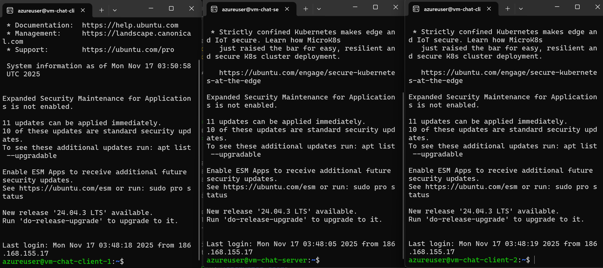
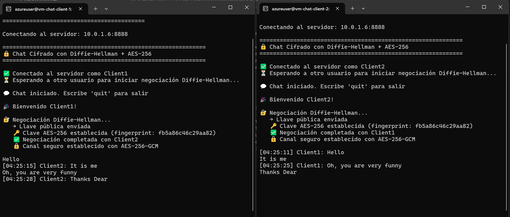
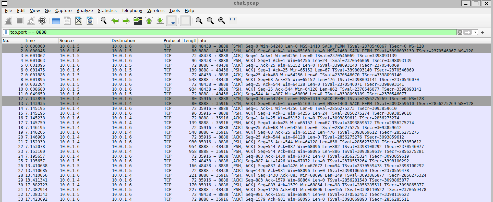
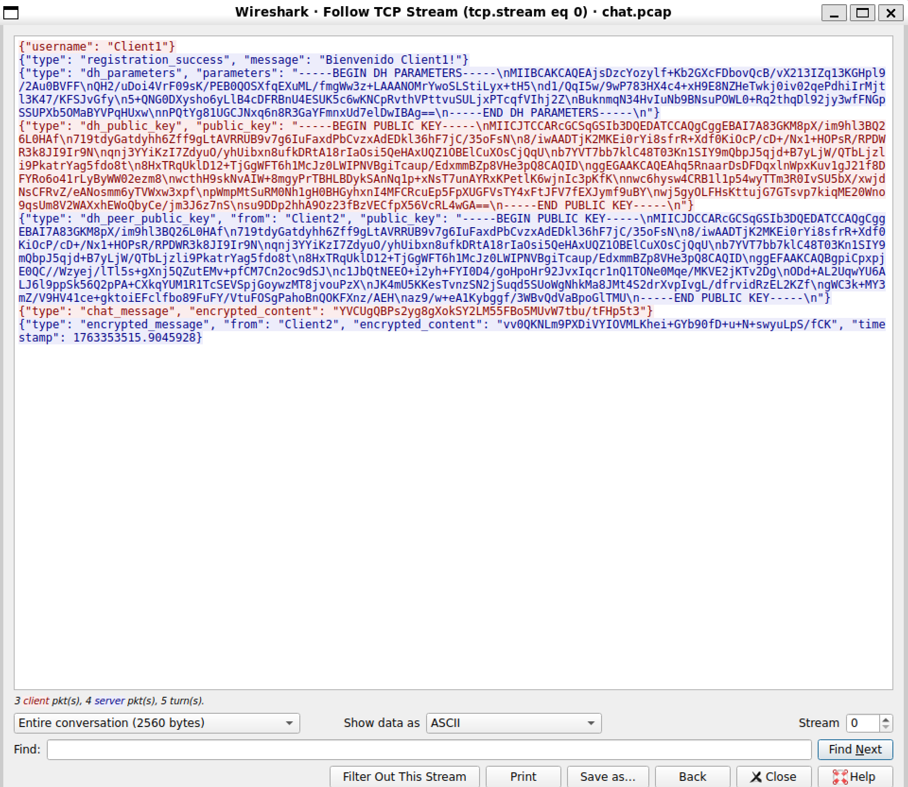
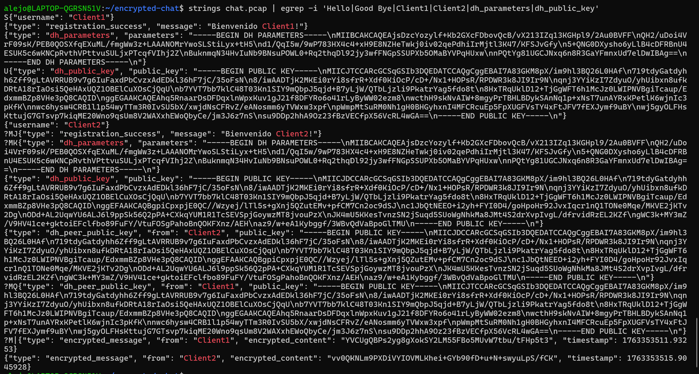
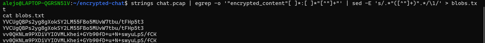

# Chat Cifrado con Diffie-Hellman y AES-256

## 1. Objetivo

Implementar un sistema de chat seguro donde dos instancias del programa ejecutadas en máquinas distintas establezcan comunicación cifrada punto a punto.  
Una vez conectadas, deben negociar una clave simétrica mediante Diffie-Hellman y utilizarla para cifrar toda la conversación usando AES-256-GCM.

El servidor actúa únicamente como relay, sin capacidad de descifrar mensajes.

---

## 2. Arquitectura General

### Componentes:

1. **Cliente**
   - Establece conexión con el servidor.
   - Realiza negociación Diffie-Hellman.
   - Deriva clave simétrica AES-256.
   - Cifra y descifra mensajes.

2. **Servidor**
   - Acepta conexiones de dos clientes.
   - Distribuye parámetros Diffie-Hellman.
   - Intercambia llaves públicas entre los clientes.
   - Retransmite mensajes cifrados sin descifrarlos.

3. **Gestor criptográfico**
   - Generación y carga de parámetros DH.
   - Generación del par llave pública/privada.
   - Cálculo de clave compartida.
   - Cifrado/descifrado con AES-256-GCM.

4. **Infraestructura (images/iaC sobre Azure)**
   - Dos máquinas virtuales Linux para ejecutar los clientes.
   - Una máquina virtual Linux para ejecutar el servidor.
   - Una red virtual común.
   - Seguridad mediante Security Groups y subredes.

---

## 3. Infraestructura Implementada (images/iaC)

Se utilizó Terraform con los siguientes módulos:

| Módulo | Recursos |
|--------|----------|
| resource group | azurerm_resource_group |
| security | azurerm_network_security_group |
| network | azurerm_virtual_network, azurerm_subnet, azurerm_subnet_network_security_group_association |
| vm | azurerm_public_ip, azurerm_network_interface, azurerm_linux_virtual_machine |

Características:

- Todas las VMs se crean en la misma VNet.
- Las reglas del NSG permiten únicamente:
  - SSH entrante
  - Puerto TCP usado para el chat (por defecto 8888)
- El servidor se ejecuta en una VM con IP pública.
- Los clientes se conectan desde máquinas remotas dentro de la misma infraestructura.

---

## 4. Flujo de Ejecución

### 4.1 Establecimiento de Conexión

1. Cada cliente se conecta al servidor mediante TCP.
2. Se envía un mensaje inicial JSON con el nombre de usuario.
3. El servidor registra ambos usuarios y espera hasta tener dos conexiones activas.

### 4.2 Negociación Diffie-Hellman

1. El servidor genera parámetros DH (p, g, 2048 bits) y los envía a ambos clientes.
2. Cada cliente:
   - Carga los parámetros.
   - Genera una llave privada y una llave pública.
   - Envía su llave pública al servidor.
3. Una vez recibidas ambas llaves públicas, el servidor las intercambia.
4. Cada cliente calcula el secreto compartido.

### 4.3 Derivación de la clave AES

- Tras obtener el secreto DH, se aplica HKDF:

```

HKDF-SHA256
longitud = 32 bytes
info = "chat-encryption-key"
salt = None

````

- La salida es la clave simétrica de 256 bits.

### 4.4 Cifrado y Descifrado

- Algoritmo: AES-256-GCM
- Datos cifrados enviados como:  
  IV (12 bytes) + TAG (16 bytes) + CIPHERTEXT
- Todo se codifica en Base64 antes de transmitirse.
- El servidor solo retransmite, no conoce la clave.


### 5. Prueba Funcional

---

#### Despliegue de la infraestructura

Ejecutar el script de despliegue:

```bash
./scripts/deploy.sh
```


---

#### Acceso por SSH a los nodos

Ingresar al servidor y clientes vía SSH:



Iniciar captura de tráfico en el servidor:

```bash
ssh azureuser@SERVER_IP "sudo tcpdump -i any port 8888 -w /tmp/chat.pcap"
```

---

#### Conexión de los clientes

Ejecutar los dos clientes para establecer la comunicación:





---

#### Validación de que no hay texto claro

Verificar que el tráfico en el puerto **8888** no contenga mensajes en texto plano:



---

#### Extracción de cadenas legibles

Extraer posibles cadenas visibles dentro del archivo `.pcap`:



---

#### Extracción de los `encrypted_content`

Filtrar únicamente los contenidos cifrados presentes en los paquetes capturados:



---

#### Validación de la estructura cifrada

Tomar una de las cadenas `encrypted_content`, decodificarla desde Base64 y revisar su estructura en hexadecimal para comprobar que corresponde al formato AES-256-GCM:

| Parte              | Tamaño mínimo |
| ------------------ | ------------- |
| Nonce / IV         | 12 bytes      |
| Ciphertext         | ≥ 1 byte      |
| Authentication Tag | 16 bytes      |


## 6. Conclusión

Se implementó correctamente un chat cifrado punto a punto donde:

* El servidor no puede descifrar mensajes.
* Los clientes establecen de forma segura una clave AES-256.
* Toda la comunicación posterior está protegida mediante cifrado autenticado.
* La infraestructura en Azure permite replicar el escenario real de múltiples máquinas conectadas dentro de la misma red segura.